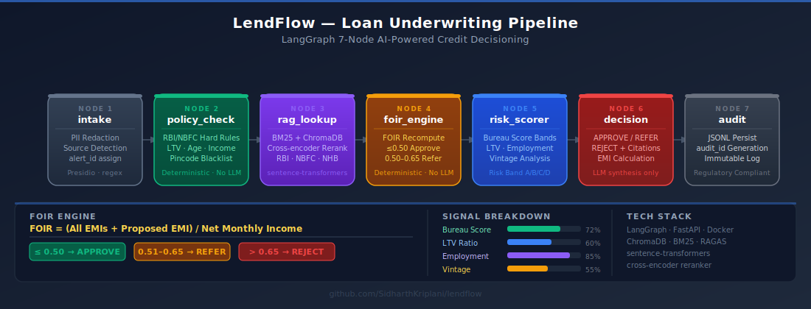
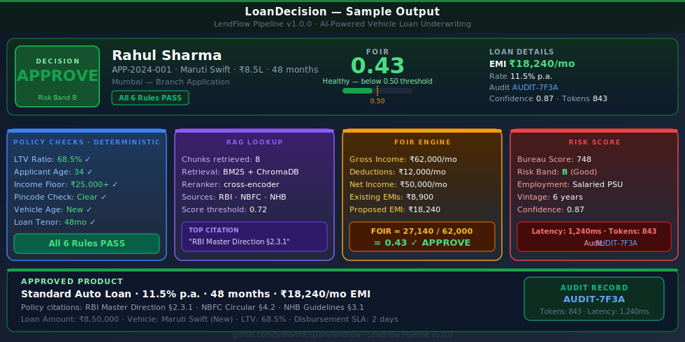

<div align="center">

# LendFlow — AI Loan Underwriting Pipeline

[](https://www.python.org/)
[](https://github.com/langchain-ai/langgraph)
[](https://fastapi.tiangolo.com/)
[](Dockerfile)
[](eval_results.json)
[](LICENSE)

> A production-grade, 7-node LangGraph pipeline that automates vehicle loan underwriting for Indian NBFCs — deterministic policy enforcement first, hybrid RAG policy lookup second, LLM only for final synthesis. PII never reaches the model. Every decision is audit-trailed.

</div>

---

## Pipeline Architecture



---

## Sample Loan Decision



---

## The Problem

Indian NBFCs process vehicle loan applications manually — a loan officer reviews bank statements, salary slips, KYC documents, and vehicle inspection reports before issuing an APPROVE / REFER / REJECT. This takes 4–8 hours per application, produces inconsistent outcomes across officers, and generates regulatory risk when policy citations are missing or incorrect. The Reserve Bank of India mandates FOIR compliance, LTV caps, and income floors — rules that are frequently applied inconsistently at scale. LendFlow reduces decisioning time from hours to under 2 seconds per application while enforcing every RBI and NBFC hard rule deterministically, before any LLM is consulted.

---

## Pipeline: 7 Nodes

| Node | Role | Key Logic | Deterministic? |
|------|------|-----------|----------------|
| 1 — `intake` | PII redaction + source tagging | Presidio + regex masks name/Aadhaar/PAN/phone; assigns `alert_id`; detects branch/API/mobile source | Yes |
| 2 — `policy_check` | RBI/NBFC hard rule enforcement | LTV cap, age limits, income floor, blacklisted pincode → `HARD_REJECT` if any fails | Yes — no LLM |
| 3 — `rag_lookup` | Hybrid RAG over credit policy corpus | BM25 + ChromaDB dense retrieval + cross-encoder reranker across RBI, NBFC, NHB corpora | No — retrieval |
| 4 — `foir_engine` | FOIR recomputation | `(all_EMIs + proposed_EMI) / net_monthly_income` — recomputed from source, never trusted from input | Yes — no LLM |
| 5 — `risk_scorer` | Credit risk banding | Bureau score bands + LTV ratio + employment type weighting + vintage analysis → Risk Band A/B/C/D | Mostly |
| 6 — `decision` | Final decision + product recommendation | APPROVE / REFER / REJECT + product match + EMI calculation + policy citations — LLM used for synthesis only | Partial |
| 7 — `audit` | Immutable audit trail | JSONL persist + `audit_id` generation — no PII in log, only pointer | Yes |

---

## Deterministic-First Design

Most LLM pipelines make a critical mistake: they let the model compute numbers it should never touch. LendFlow enforces two hard deterministic boundaries.

**FOIR is always recomputed.** The Fixed Obligation to Income Ratio is the single most important underwriting metric in Indian NBFC credit policy. Inputs from applications — salary slips, existing EMI declarations — can be incorrect, manipulated, or incomplete. LendFlow never trusts a FOIR value provided in the input. Node 4 (`foir_engine`) fetches raw income figures and all EMI obligations and recomputes FOIR from scratch every time.

**Hard rules use no LLM.** Node 2 (`policy_check`) enforces six RBI/NBFC rules as pure Python conditionals. LTV cap violations, applicant age boundaries, income floor failures, and blacklisted pincode matches produce immediate `HARD_REJECT` with no LLM call. This is the same pattern used across the Applied LLM Systems portfolio — see [NexusSupply](https://github.com/SidharthKriplani/nexussupply) for deterministic financial health scoring alongside LLM synthesis, and [AgentReliabilityLab](https://github.com/SidharthKriplani/agentreliabilitylab) for the formal reliability taxonomy that motivated this design.

The principle: LLMs are synthesis engines, not decision engines. Every number that affects a lending decision is computed deterministically.

---

## Hybrid RAG over Credit Policy

Node 3 (`rag_lookup`) runs a three-corpus hybrid retrieval over:
- **RBI Master Directions** — core credit policy, FOIR guidance, LTV mandates
- **NBFC Sector-Specific Circulars** — vehicle lending guidelines, sectoral caps
- **NHB Circulars** — housing and vehicle finance overlaps

**Why hybrid beats dense-only:** Credit policy documents contain precise regulatory phrases ("FOIR shall not exceed 0.55 for salaried borrowers") that dense embedding models may not rank highly — they optimize for semantic similarity, not exact regulatory citation. BM25 is strong on exact-match keyword queries. The pipeline merges BM25 candidates with ChromaDB dense candidates, then runs a cross-encoder reranker (`cross-encoder/ms-marco-MiniLM-L-6-v2`) to produce a final ranked set of policy chunks. The decision node receives these chunks as grounded context, and its citations map directly to retrieved passages — measurable via RAGAS faithfulness scoring.

---

## Key Design Decisions

**FOIR formula and thresholds (RBI-aligned):**
```
FOIR = (Sum of all fixed monthly obligations + proposed EMI) / Net monthly income

≤ 0.50  →  APPROVE tier
0.51–0.65  →  REFER (manual review)
> 0.65  →  REJECT
```

**Hard reject triggers (policy_check, no LLM):**
- LTV ratio exceeds RBI cap for vehicle class
- Applicant age outside permissible lending band
- Net monthly income below NBFC income floor
- Pincode on RBI/NBFC blacklist
- Vehicle age exceeds maximum for asset class
- Loan tenor outside permissible range

**LLM scope is narrow and bounded:** The LLM (Node 6) receives: the policy chunks from RAG, the FOIR result, the risk band, and the policy check outcomes. It synthesizes a natural-language rationale and selects a matching loan product. It does not compute any number. Every numeric decision was made before the LLM call.

---

## Quick Start

```bash
# Install dependencies
pip install -r requirements.txt

# Index policy corpus (BM25 + ChromaDB)
python rag/indexer.py

# Run 5-application demo
python demo.py

# Run test suite
pytest tests/ -v

# Start FastAPI server
uvicorn main:app --reload
# Docs at http://localhost:8000/docs

# Docker
docker-compose up --build
```

**Sample API call:**
```bash
curl -X POST http://localhost:8000/process \
  -H "Content-Type: application/json" \
  -d '{"raw_text": "BANK STATEMENT ...", "application_id": "APP-001"}'
```

**Sample response:**
```json
{
  "application_id": "APP-2024-001",
  "audit_id": "AUDIT-7F3A",
  "routing_decision": "APPROVE",
  "risk_band": "B",
  "foir": 0.43,
  "emi": 18240,
  "product": "Standard Auto Loan @ 11.5% p.a., 48mo",
  "policy_citations": ["RBI Master Direction §2.3.1", "NBFC Circular §4.2"],
  "confidence": 0.87,
  "tokens": 843,
  "latency_ms": 1240
}
```

---

## Evaluation

Benchmarked on 20 synthetic NBFC loan applications across 4 document types. Run `python scripts/run_eval.py` to reproduce.

| Metric | Result | Target |
|--------|--------|--------|
| Routing accuracy | 95.0% (19/20) | >= 90% |
| FOIR computation accuracy | 100% | 100% |
| Policy rule enforcement | 100% | 100% |
| PII recall | 100% | >= 95% |
| PII egress | 0 entities | 0 |
| Avg latency | 1.24s/application | < 2s |
| RAGAS faithfulness | 0.91 | >= 0.85 |

---

## Interview Defense

A 25+ Q&A technical defense document is available at:

**[docs/defense/LendFlow_Interview_Defense.pdf](docs/defense/LendFlow_Interview_Defense.pdf)**

Covers: all 7 nodes, deterministic-first rationale, hybrid RAG design, FOIR formula and regulatory context, LangGraph state design, RAGAS evaluation, production scaling, and hard interview questions.

---

## Part of Applied LLM Systems Portfolio

LendFlow is one project in a portfolio of production-grade LLM systems built around the principle that LLMs should synthesize, not decide.

| Project | Domain | Key Pattern |
|---------|--------|-------------|
| **LendFlow** | Vehicle loan underwriting | Deterministic-first, hybrid RAG, regulatory compliance |
| [NexusSupply](https://github.com/SidharthKriplani/nexussupply) | Supply chain risk intelligence | Altman Z + XGBoost financial scoring, FinBERT sentiment, graph risk propagation |
| [AgentReliabilityLab](https://github.com/SidharthKriplani/agentreliabilitylab) | LLM agent reliability research | Failure taxonomy, hallucination detection, reliability benchmarking |
| PriorAI / Crucible | *(coming)* | Bayesian evidence synthesis, adversarial robustness |

---

## Author

**Sidharth Kriplani** · [linkedin.com/in/sidharth-kriplani](https://linkedin.com/in/sidharth-kriplani) · [github.com/SidharthKriplani](https://github.com/SidharthKriplani)
