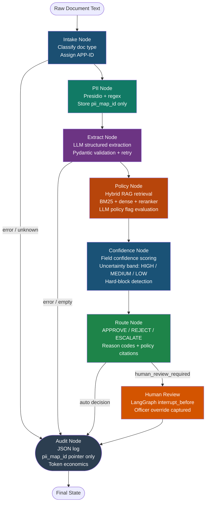

# LendFlow

**LLM-powered vehicle loan document decisioning pipeline**  
Local-first · Privacy-preserving · Audit-ready · Human-in-the-loop

---

## What it does

LendFlow automates the manual credit decisioning workflow at NBFCs and vehicle lending fintechs. A loan officer today reads a bank statement, salary slip, KYC document, and vehicle inspection report — then decides whether to approve, reject, or escalate. This takes hours per application and is inconsistent across officers.

LendFlow does this end-to-end:

1. Classifies the document type
2. Redacts PII before it ever reaches the LLM
3. Extracts structured fields using a local LLM (LM Studio)
4. Retrieves relevant RBI/NBFC credit policy clauses via hybrid RAG
5. Scores confidence in every extracted field
6. Routes to **APPROVE / REJECT / ESCALATE** with policy-cited reasons
7. Triggers human review for low-confidence or borderline cases
8. Writes a complete audit log

**PII never leaves the device.** LM Studio runs fully local — the data residency story is built in.

---

## Architecture



---

## Stack

| Layer | Technology |
|---|---|
| Orchestration | LangGraph 0.2+ (StateGraph, conditional edges, HITL interrupt) |
| LLM | LM Studio local (OpenAI-compatible) / swap to GPT-4o-mini via `.env` |
| PII Redaction | Microsoft Presidio + custom India recognizers (Aadhaar, PAN, IFSC) |
| Embeddings | `sentence-transformers/all-MiniLM-L6-v2` |
| Dense Retrieval | ChromaDB (persistent) |
| Sparse Retrieval | BM25 (rank-bm25) |
| Reranker | `cross-encoder/ms-marco-MiniLM-L-6-v2` |
| Validation | Pydantic v2 (per-doc-type extraction schemas) |
| Serving | FastAPI + Uvicorn |
| Packaging | Docker + Docker Compose |
| Evaluation | RAGAS-compatible eval harness, pytest |
| CI | GitHub Actions |

---

## Project structure

```
lendflow/
├── config.py                        # All env-backed configuration
├── main.py                          # FastAPI application
├── demo.py                          # 5-app demo script
├── requirements.txt
├── Dockerfile
├── docker-compose.yml
├── .env.example
│
├── pipeline/
│   ├── state.py                     # LendFlowState TypedDict + Pydantic models
│   ├── graph.py                     # LangGraph DAG assembly
│   └── nodes/
│       ├── intake.py                # Node 1: doc classification
│       ├── pii.py                   # Node 2: PII redaction
│       ├── extract.py               # Node 3: LLM structured extraction
│       ├── policy.py                # Node 4: RAG policy evaluation
│       ├── confidence.py            # Node 5: uncertainty scoring
│       ├── route.py                 # Node 6: routing decision
│       └── audit.py                 # Node 7: audit log writer
│
├── rag/
│   ├── indexer.py                   # Chunk → embed → ChromaDB + BM25 corpus
│   ├── retriever.py                 # Hybrid retrieval + reranking
│   └── policy_docs/
│       ├── rbi_nbfc_credit_policy.txt
│       └── lendflow_internal_credit_policy.txt
│
├── scripts/
│   ├── generate_test_data.py        # 20 synthetic applications + ground truth
│   └── run_eval.py                  # Full evaluation harness
│
└── tests/
    ├── conftest.py
    ├── test_pii.py                  # PII recall ≥ 95%
    ├── test_routing.py              # Routing accuracy ≥ 90%
    ├── test_e2e.py                  # End-to-end with mocked LLM
    └── fixtures/
        ├── applications/            # 20 synthetic .txt documents
        └── ground_truth/            # 20 _gt.json files
```

---

## Quickstart

### Prerequisites
- Python 3.11+
- [LM Studio](https://lmstudio.ai/) running locally with a Llama 3.1 8B model loaded
- LM Studio server enabled at `http://localhost:1234/v1`

### 1. Install dependencies

```bash
cd lendflow
pip install -r requirements.txt
python -m spacy download en_core_web_lg
```

### 2. Configure environment

```bash
cp .env.example .env
# Edit .env if using a different model or OpenAI
```

### 3. Generate synthetic test data

```bash
python scripts/generate_test_data.py
```

### 4. Index policy documents

```bash
python rag/indexer.py
```

### 5. Run the demo

```bash
python demo.py
```

### 6. Run all tests

```bash
pytest tests/ -v
```

### 7. Full evaluation harness

```bash
python scripts/run_eval.py
```

### 8. Start the API

```bash
uvicorn main:app --reload
# API docs at http://localhost:8000/docs
```

### 9. Docker

```bash
docker-compose up --build
```

---

## API reference

### `POST /process`

```json
{
  "raw_text": "BANK ACCOUNT STATEMENT ...",
  "application_id": "APP-001",
  "thread_id": "thread-001"
}
```

Response:
```json
{
  "application_id": "APP-001",
  "audit_id": "AUDIT-a1b2c3d4",
  "doc_type": "bank_statement",
  "routing_decision": "APPROVE",
  "reason_codes": ["FOIR_WITHIN_LIMIT"],
  "human_review_required": false,
  "uncertainty_band": "HIGH",
  "uncertainty_score": 0.09,
  "pii_entity_count": 4,
  "error": null,
  "pipeline_version": "1.0.0"
}
```

### `POST /human-review/override`

Resume a paused HITL pipeline with officer decision.

### `GET /audit/{audit_id}`

Retrieve full audit log for a completed application.

### `GET /health`

Liveness probe — returns LLM endpoint and model config.

---

## Switching to OpenAI

Edit `.env`:

```env
LLM_BASE_URL=https://api.openai.com/v1
LLM_API_KEY=sk-...
LLM_MODEL=gpt-4o-mini
```

No code changes required. Three environment variable changes.

---

## Evaluation targets

| Metric | Target | Method |
|---|---|---|
| PII recall | ≥ 95% | Regex scan pre/post redaction on 20 docs |
| Field extraction F1 | ≥ 85% | vs. ground truth JSON |
| Routing accuracy | ≥ 90% | vs. ground truth routing labels |
| End-to-end latency | < 10s | Per application, LM Studio local |

---

## Design decisions

**Why LangGraph instead of a simple pipeline?**  
Conditional routing, checkpointing for HITL, and interrupt_before semantics are native to LangGraph. A linear chain can't pause and resume for human review.

**Why keep PII out of state?**  
The state is passed to the LLM and written to audit logs. If PII were in state, every LLM call would be a data residency risk and every audit log would be a compliance violation. The pii_map lives only in memory (or an encrypted KV store in production), and state carries only a UUID pointer.

**Why hybrid RAG (BM25 + dense) instead of dense-only?**  
Policy documents contain exact regulatory phrases ("FOIR shall not exceed 55%") that dense retrieval may not rank highly. BM25 is strong on exact-match keyword queries. The cross-encoder reranker then re-scores the merged candidate set for the best of both.

**Why LM Studio instead of OpenAI API?**  
Data residency. Loan application data contains sensitive financial and identity information. Running locally means PII never leaves the device — a hard requirement for regulated NBFC environments. The OpenAI client's `base_url` parameter makes this a zero-code swap if cloud is needed.

---

## Author

**Sidharth Kriplani** · [linkedin.com/in/sidharth-kriplani](https://linkedin.com/in/sidharth-kriplani) · [github.com/SidharthKriplani](https://github.com/SidharthKriplani)
